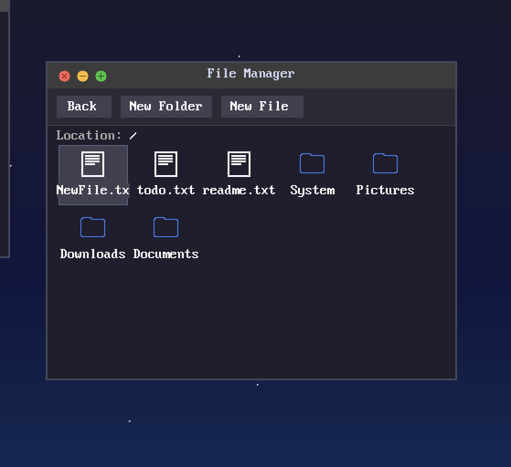
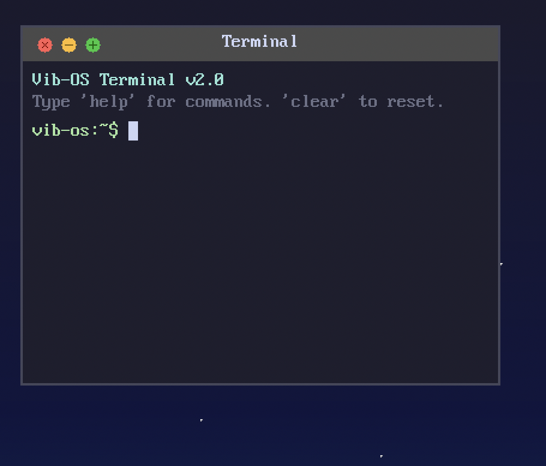
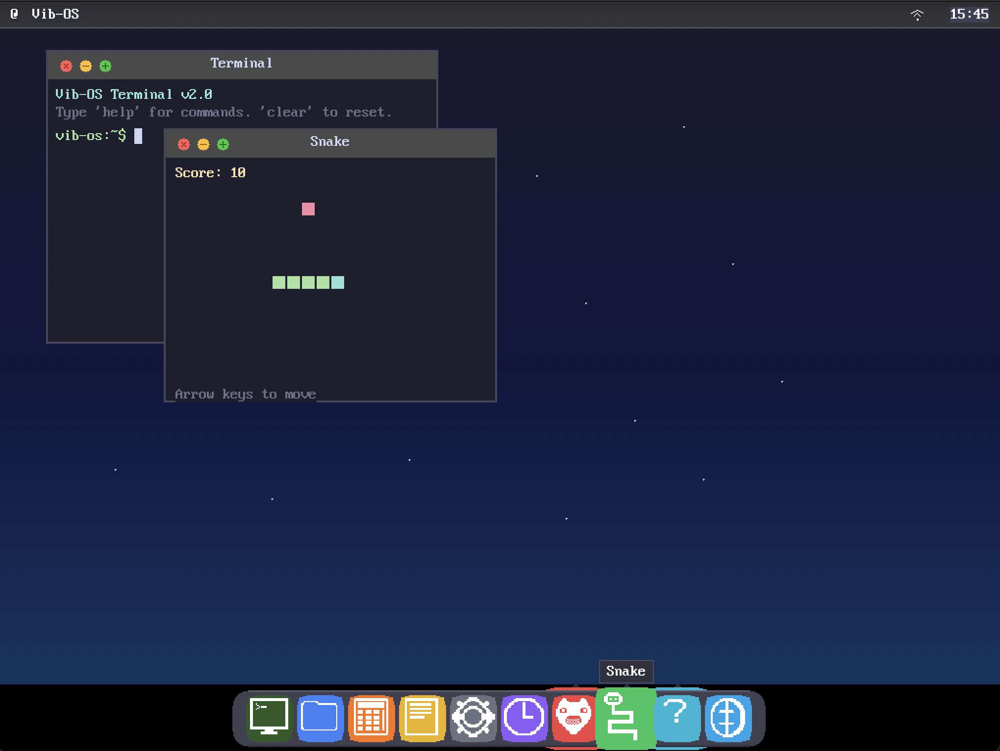

# Vib-OS

**ARM64 Operating System with GUI**


```
        _  _         ___  ____ 
 __   _(_)| |__     / _ \/ ___| 
 \ \ / / || '_ \   | | | \___ \ 
  \ V /| || |_) |  | |_| |___) |
   \_/ |_||_.__/    \___/|____/ 

Vib-OS v0.5.0 - ARM64 with Full GUI
```

## Overview

Vib-OS is a from-scratch, Unix-like operating system for ARM64 architectures. It features a custom kernel, a modern macOS-inspired graphical user interface, a full TCP/IP networking stack, and a Virtual File System (VFS). Built with **18,000+ lines** of C and Assembly, it runs natively on QEMU, Apple Silicon (via UTM), and Raspberry Pi 4/5.

## 📸 Screenshots

### Desktop & File Manager

*Modern file manager with icon grid, navigation, file creation (New File/Folder), and renaming capabilities.*

### Terminal & Shell

*VT100-compatible terminal with command history, `ls`, `cd`, and shell utilities.*

### Applications (Snake Game)

*Interactive Snake game with score tracking and keyboard controls.*

### Doom

*Doom running natively on Vib-OS.*

## 🏗 Architecture

```mermaid
graph TD
    subgraph Userspace ["Userspace (EL0)"]
        GUI[Window Manager & GUI Apps]
        Shell[Terminal / Shell]
        Doom[Doom Engine]
    end

    subgraph Kernel ["Kernel (EL1)"]
        Syscall[Syscall Interface (SVC)]
        
        subgraph Subsystems
            VFS[Virtual File System]
            Process[Process Scheduler]
            Net[TCP/IP Networking Stack]
            Mem[Memory Manager (PMM/VMM)]
        end
        
        subgraph Drivers
            VirtioNet[Virtio Net]
            VirtioInput[Virtio Input (Tablet/Kbd)]
            GIC[GICv3 Interrupts]
            PL031[PL031 RTC]
            PL011[PL011 UART]
            HDA[Intel HDA Audio]
        end
    end

    GUI --> Syscall
    Shell --> Syscall
    Doom --> Syscall
    
    Syscall --> VFS
    Syscall --> Process
    Syscall --> Net
    
    VFS --> RamFS
    Net --> VirtioNet
    Process --> Mem
    
    Drivers --> Hardware
```

## ✨ Features

### 🖥 Graphical User Interface
- **Window Manager**: Draggable windows with focus management and z-ordering.
- **Traffic Light Controls**: Close, Minimize, and Maximize buttons.
- **Taskbar & Dock**: Animated dock with hover labels; top menu bar with clock and WiFi status.
- **Compositor**: Double-buffered rendering engine for flicker-free visuals.

### 📂 File System (VFS)
- **Virtual File System**: Unified interface for different filesystems.
- **RamFS**: In-memory filesystem for temporary storage.
- **Interactive File Manager**:
  - Grid view for files and folders.
  - **New!!** Rename support via GUI dialog.
  - Create new files and folders.
  - Notepad integration for editing text files.

### 🌐 Networking
- **Virtio-Net Driver**: High-performance network interface.
- **TCP/IP Stack**: Custom implementation of Ethernet, ARP, IP, ICMP, UDP, and TCP.
- **Host Passthrough**: Full internet access via QEMU user networking.
- **WiFi Status**: Visual indicator in the menu bar.

### 🛠 Core System
- **Kernel**: Preemptive multitasking scheduler, 4-level paging (MMU).
- **Drivers**: GICv3 Interrupt Controller, PL031 RTC (Real Time Clock), PL011 UART.
- **Input**: Absolute mouse positioning (Virtio Tablet) and full keyboard support.

### 📦 Applications
- **Terminal**: `ls`, `cd`, `help`, `clear`, environment variables.
- **Notepad**: Text editor with save/load functionality backed by VFS.
- **Snake**: Classic game with graphics and score.
- **Calculator**: Basic arithmetic operations.
- **Doom**: Ported and running with graphics support.

## 🚧 Pending Tasks & Known Issues

Although significant progress has been made, the following features are currently in development or partially implemented:
1.  **Sound Support**: Intel HDA driver is initialized, but audio playback is currently unstable or not working correctly in all apps.
2.  **Network Settings UI**: The settings window for configuring static IPs or WiFi credentials is not yet fully implemented.
3.  **Full Web Browser**: The browser application handles basic rendering but lacks a full HTML parser and real HTTP request engine (currently stubbed).

## 🗺 Roadmap

- [ ] **Hard Disk Storage**: Currently, the system uses **RAM-only storage** (RamFS). All data is lost on reboot. Implementing a persistent hard disk driver (EXT4/FAT32) is a high-priority todo.
- [ ] **browser Engine**: Implement a basic HTML tokeniser and renderer.
- [ ] **Audio**: Fix buffer management for Intel HDA to enable smooth PCM playback.
- [ ] **Multi-threading**: Enhanced user-space threading support.
- [ ] **User Accounts**: Basic login screen and multi-user support.

## 🚀 Quick Start

### Build & Run
```bash
# Clone the repository
git clone git@github.com:viralcode/vib-OS.git
cd vib-OS

# Build Kernel & Userspace
make all

# Run with GUI (QEMU)
make run-gui
```

### Build Bootable Image (USB)
```bash
make image          # Creates unixos.img (EFI bootable)
```
*To write to a USB drive (replace `diskX` with your drive):*
```bash
sudo dd if=image/unixos.img of=/dev/diskX bs=4m status=progress
```

### Run in Text Mode
```bash
make run
```

## 🤝 Contributing

This project is open source and we welcome contributions!

1.  **Fork** the repository.
2.  Create a **Feature Branch** (`git checkout -b feature/NewFeature`).
3.  **Commit** your changes (`git commit -m 'Add NewFeature'`).
4.  **Push** to the branch (`git push origin feature/NewFeature`).
5.  Open a **Pull Request**.

### Coding Standards
- Use **C11** standard.
- Follow the kernel coding style (4-space indentation).
- Ensure new features work on QEMU ARM64.
