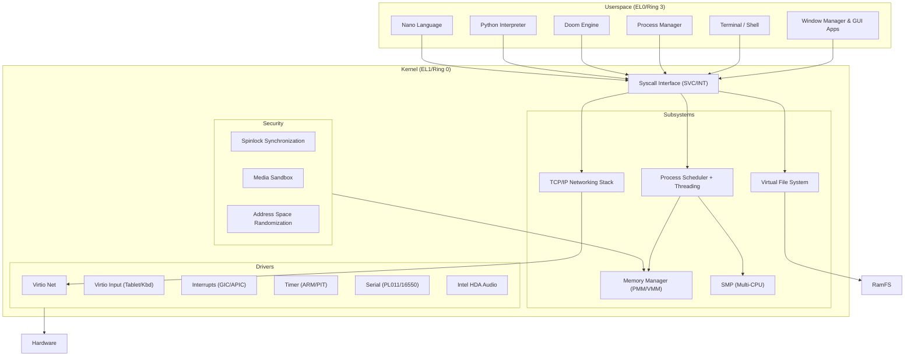

# Vib-OS

**Multi-Architecture Operating System with GUI**


```
        _  _         ___  ____ 
 __   _(_)| |__     / _ \/ ___| 
 \ \ / / || '_ \   | | | \___ \ 
  \ V /| || |_) |  | |_| |___) |
   \_/ |_||_.__/    \___/|____/ 

Vib-OS v2.2.0 - Multi-Architecture OS with Full GUI
```

<p align="center">
  
</p>

## Overview

Vib-OS is a from-scratch, Unix-like operating system with **full multi-architecture support** for **ARM64** and **x86_64**. It features a custom kernel, a modern macOS-inspired graphical user interface, a full TCP/IP networking stack, and a Virtual File System (VFS). Built with **25,000+ lines** of C and Assembly, it runs natively on QEMU, real hardware (Raspberry Pi 4/5, x86_64 PCs), and Apple Silicon (via UTM).

## 🎯 Multi-Architecture Support

| Architecture | Boot Method | Status | Hardware |
|--------------|-------------|--------|----------|
| **ARM64** | Direct / UEFI | ✅| Raspberry Pi 4/5, QEMU virt, Apple Silicon (VM) |
| **x86_64** | Direct / UEFI / BIOS | ✅  will be released soon. | Modern PCs, QEMU, VirtualBox, VMware |
| **x86** | Direct / BIOS (MBR) | ✅ **Builds Successfully** | Legacy PCs, QEMU pc |

### What Works Now

- ✅ **ARM64**: Fully tested and stable on QEMU and Raspberry Pi
- ✅ **x86_64**: Kernel builds and boots successfully
- ✅ **x86 32-bit**: Kernel builds successfully (testing in progress)
- ✅ **Architecture Abstraction Layer**: Clean separation of arch-specific code
- ✅ **Context Switching**: Working for ARM64, x86_64, and x86
- ✅ **Memory Management**: MMU/paging for all architectures
- ✅ **Interrupt Handling**: GICv3 (ARM64), APIC (x86_64), PIC (x86)

## 📸 Screenshots

### Main Desktop

*Vib-OS desktop with animated dock, menu bar, and wallpaper system.*

### File Manager

*Modern file manager with icon grid, navigation, file creation (New File/Folder), and renaming capabilities.*

### Terminal & Shell

*VT100-compatible terminal with command history, Python and Nano language support.*

### Image Viewer

*JPEG image viewer with zoom, rotate, and pan support.*

### Snake Game

*Interactive Snake game with score tracking and keyboard controls.*

### Context Menu

*Right-click context menu for desktop operations.*

### Wallpaper Settings

*Customizable wallpaper system with live preview.*

### Doom

*Classic Doom running natively with full graphics, input, and sound support.*

## 🏗 Architecture



## ✨ Features

### 🖥 Graphical User Interface
- **Window Manager**: Draggable and **resizable** windows with focus management and z-ordering
- **Traffic Light Controls**: Close, Minimize, and Maximize buttons (macOS-style)
- **Window Resizing**: Drag any edge or corner to resize windows (all 8 directions supported)
- **Taskbar & Dock**: Animated dock with hover magnification and labels; top menu bar with clock and WiFi status
- **Compositor**: Double-buffered rendering engine for flicker-free visuals
- **Modern Design**: Clean, intuitive interface inspired by macOS
- **Context Menus**: Right-click menus for desktop and file operations

### 📂 File System (VFS)
- **Virtual File System**: Unified interface for different filesystems
- **RamFS**: In-memory filesystem for temporary storage
- **EXT4 Read/Write Support**: Full implementation including:
  - Block bitmap management (alloc/free)
  - Inode bitmap management (alloc/free)
  - Directory entry creation
  - File creation and writing
  - Indirect block support (single/double)
  - Superblock sync
- **APFS Support**: Read support for Apple File System (experimental)
- **Interactive File Manager**:
  - Grid view for files and folders
  - Rename support via GUI dialog
  - Create new files and folders
  - Notepad integration for editing text files
  - File icons and visual feedback

### 🐍 Programming Language Support
- **Python Interpreter**: Run Python scripts directly in the terminal
  ```bash
  $ python examples/hello.py
  Hello, Vib-OS!
  
  $ python examples/fibonacci.py
  0, 1, 1, 2, 3, 5, 8, 13, 21, 34
  ```
- **Nano Language**: Lightweight scripting language ([github.com/jordanhubbard/nanolang](https://github.com/jordanhubbard/nanolang))
  ```bash
  $ nano examples/hello.nano
  Hello from Nano!
  
  $ nano examples/calculator.nano
  Result: 42
  ```

### 🌐 Networking
- **Virtio-Net Driver**: High-performance network interface
- **TCP/IP Stack**: Custom implementation of Ethernet, ARP, IP, ICMP, UDP, and TCP
- **Host Passthrough**: Full internet access via QEMU user networking
- **DNS Resolution**: Built-in DNS client
- **Socket API**: Berkeley sockets-compatible interface
- **WiFi Status**: Visual indicator in the menu bar

### 🔒 Security Features
- **Spinlock Synchronization**: IRQ-safe spinlocks for ARM64 and x86_64
- **Media Sandbox**: Fault-isolating sandbox for media decoders
- **ASLR**: Address Space Layout Randomization for process protection
- **NX Protections**: Non-executable page support

### 🛠 Core System
- **Multi-Architecture Kernel**: Supports ARM64 and x86_64 with clean abstraction layer
- **Preemptive Multitasking**: Priority-based scheduler with context switching
- **Process Manager**: GUI app showing all running processes with kill functionality
- **Multi-threading**: Full thread support via `clone()` syscall with `CLONE_VM` for shared memory
- **Userspace Execution**: Complete `sys_execve` implementation:
  - ELF loading with validation
  - User stack setup (argc/argv/envp)
  - Jump to userspace via `eret` (ARM64) or `iretq` (x86_64)
- **SMP Support**: Symmetric Multi-Processing infrastructure (boots on CPU 0, secondary CPU support ready)
- **Memory Management**: 4-level paging (ARM64) and 4-level paging (x86_64)
- **Virtual Memory**: Full MMU support with demand paging
- **Interrupt Handling**: 
  - ARM64: GICv3 (Generic Interrupt Controller)
  - x86_64: APIC (Advanced Programmable Interrupt Controller)
- **Timers**:
  - ARM64: ARM Generic Timer
  - x86_64: PIT (Programmable Interval Timer)
- **Serial Console**:
  - ARM64: PL011 UART
  - x86_64: 16550 UART (COM1)

### 🎮 Input & Output
- **Absolute Mouse**: Virtio Tablet for precise cursor positioning
- **Keyboard**: Full keyboard support with key repeat
- **Framebuffer**: Direct framebuffer access for graphics
- **Display Drivers**:
  - QEMU ramfb (ARM64)
  - VGA/VESA (x86_64)
  - Bochs Graphics Adapter

### 🔊 Audio & Media
- **Intel HDA**: High Definition Audio controller driver
- **PCM Playback**: 16-bit stereo audio support
- **MP3 Decoder**: minimp3 library integration for MP3 playback
- **JPEG Decoder**: picojpeg library for image viewing
- **Media Pipeline**: Load and decode media files from VFS

### 📦 Applications
- **Terminal**: `ls`, `cd`, `help`, `clear`, `cat`, `echo`, `play`, `view`, `python`, `nano` commands
- **Notepad**: Text editor with save/load functionality backed by VFS
- **Image Viewer**: JPEG image viewer with zoom, rotate, and pan support
- **Audio Player**: MP3 playback support via minimp3 decoder
- **Process Manager**: View running processes (PID, name, state) with kill button
- **Snake**: Classic game with graphics and score tracking
- **Calculator**: Basic arithmetic operations with GUI
- **File Manager**: Browse, create, rename, and delete files (click images/audio to open)
- **Doom**: Full Doom port with graphics, input, and sound
- **Clock**: Real-time analog clock with hour/minute/second hands
- **Settings**: System settings including wallpaper configuration
- **About**: System information dialog

## 🚀 Quick Start

### Prerequisites

**macOS:**
```bash
# Install Xcode Command Line Tools
xcode-select --install

# Install QEMU
brew install qemu
```

**Linux:**
```bash
# Ubuntu/Debian
sudo apt-get install qemu-system-aarch64 qemu-system-x86 gcc-aarch64-linux-gnu make

# Arch Linux
sudo pacman -S qemu-system-aarch64 qemu-system-x86 aarch64-linux-gnu-gcc make
```

### ARM64 (Default - Recommended)

```bash
# Clone the repository
git clone https://github.com/viralcode/vib-OS.git
cd vib-OS

# Build everything (kernel, drivers, userspace)
make all

# Run with GUI (opens QEMU window)
make run-gui

# Or run in text mode
make run

# Or run with QEMU (headless testing)
make qemu
```

### x86_64 (Multi-Architecture Build)

```bash
# Build for x86_64


# Test in QEMU
make -f Makefile.multiarch ARCH=x86_64 qemu
```

### Available Make Targets

```bash
# ARM64 (default Makefile)
make all          # Build everything
make kernel       # Build kernel only
make drivers      # Build drivers only
make libc         # Build C library
make userspace    # Build userspace programs
make image        # Create bootable disk image
make run          # Run in QEMU (text mode)
make run-gui      # Run in QEMU (GUI mode)
make qemu         # Run in QEMU (headless)
make qemu-debug   # Run with GDB server
make clean        # Clean build artifacts

# Multi-Architecture (Makefile.multiarch)
make -f Makefile.multiarch ARCH=arm64 kernel
make -f Makefile.multiarch ARCH=x86_64 kernel
make -f Makefile.multiarch ARCH=x86 kernel
```

## 💾 Creating Bootable Media

### For ARM64 (Raspberry Pi 4/5)

```bash
# Build bootable image
make image

# Write to SD card (replace diskX with your SD card)
# macOS
sudo dd if=image/unixos.img of=/dev/rdiskX bs=4m status=progress

# Linux
sudo dd if=image/unixos.img of=/dev/sdX bs=4M status=progress && sync
```

### For x86_64 PC


## 🧪 Testing

### QEMU (Recommended)

```bash
# ARM64 with GUI
make run-gui

# ARM64 text mode
make run

# ARM64 headless (for CI/automation)
make qemu

# x86_64
make -f Makefile.multiarch ARCH=x86_64 qemu
```

### Real Hardware

#### Raspberry Pi 4/5
1. Build image: `make image`
2. Write to SD card: `sudo dd if=image/unixos.img of=/dev/sdX bs=4M`
3. Insert SD card and power on

#### x86_64 PC
1. Create bootable USB: `./scripts/create-uefi-image.sh`
2. Write to USB: `sudo dd if=vibos-uefi.img of=/dev/sdX bs=4M`
3. Boot from USB (select UEFI boot in BIOS)

### Apple Silicon (M1/M2/M3/M4)

Use Qemu. 

## 🚧 Current Status & Known Issues

### What Works
- ✅ ARM64 kernel boots and runs stably
- ✅ x86_64 kernel builds successfully
- ✅ GUI system with windows, dock, and applications
- ✅ File system (RamFS) with file manager
- ✅ **EXT4 Read/Write Support** - Full implementation with block/inode allocation
- ✅ Networking (TCP/IP stack, virtio-net)
- ✅ Process management with GUI process manager
- ✅ Multi-threading via clone() syscall
- ✅ SMP infrastructure initialized
- ✅ **Complete sys_execve** - Loads ELF, sets up user stack, jumps to userspace
- ✅ Input (keyboard and mouse)
- ✅ Doom runs with full graphics
- ✅ Python and Nano language interpreters
- ✅ Security features (spinlocks, sandbox, ASLR)

### Known Issues
1. **Sound Support**: Intel HDA driver works but audio may be choppy in QEMU
2. **x86_64 Testing**: Needs more real hardware testing
3. **Network Settings UI**: Not fully implemented
4. **Web Browser**: Basic rendering only, no full HTML parser

### Roadmap
- [x] ~~**Multi-core**: SMP support for multiple CPUs~~ *(Infrastructure complete)*
- [x] ~~**Process Manager**: View and kill running processes~~ *(Done)*
- [x] ~~**Multi-threading**: Thread creation via clone()~~ *(Done)*
- [x] ~~**EXT4 Write Support**: Full read/write with bitmap management~~ *(Done)*
- [x] ~~**Userspace Execution**: Complete sys_execve implementation~~ *(Done)*
- [ ] **x86 32-bit**: Complete kernel implementation
- [ ] **USB Support**: Add USB mass storage and HID drivers
- [ ] **User Accounts**: Login screen and multi-user support
- [ ] **Package Manager**: Install/remove applications
- [ ] **PNG Support**: Add PNG image decoder
- [ ] **Video Player**: Basic video playback support

## 🤝 Contributing

We welcome contributions! Here's how to get started:

1. **Fork** the repository
2. Create a **Feature Branch** (`git checkout -b feature/NewFeature`)
3. **Commit** your changes (`git commit -m 'Add NewFeature'`)
4. **Push** to the branch (`git push origin feature/NewFeature`)
5. Open a **Pull Request**

### Coding Standards
- Use **C11** standard
- Follow kernel coding style (4-space indentation, K&R braces)
- Test on both ARM64 and x86_64 (if applicable)
- Add comments for complex logic
- Update documentation for new features

### Areas for Contribution
- 🐛 **Bug Fixes**: Fix known issues
- 🎨 **GUI Improvements**: Enhance window manager, add widgets
- 🔧 **Drivers**: Add support for new hardware
- 📦 **Applications**: Create new userspace programs
- 📚 **Documentation**: Improve guides and comments
- 🧪 **Testing**: Test on real hardware and report issues

## 📄 License

This project is licensed under the MIT License - see the [LICENSE](LICENSE) file for details.

## 🙏 Acknowledgments

- **DOOM**: id Software for the original Doom engine
- **minimp3**: lieff for the MP3 decoder library
- **picojpeg**: Rich Geldreich for the JPEG decoder
- **Nano Language**: [Jordan Hubbard](https://github.com/jordanhubbard/nanolang) for the Nano scripting language
- **QEMU**: The QEMU team for the excellent emulator
- **OSDev Community**: For invaluable resources and documentation

## 📞 Contact

**Author:** [JIJO JOHN](https://jijojohn.me)

- **Website**: [jijojohn.me](https://jijojohn.me)
- **GitHub**: [github.com/viralcode](https://github.com/viralcode)
- **Repository**: [viralcode/vib-OS](https://github.com/viralcode/vib-OS)
- **Issues**: [Report bugs or request features](https://github.com/viralcode/vib-OS/issues)

---

**Made with ❤️ by [JIJO JOHN](https://jijojohn.me)**

*"Building an OS from scratch, one line at a time."*
